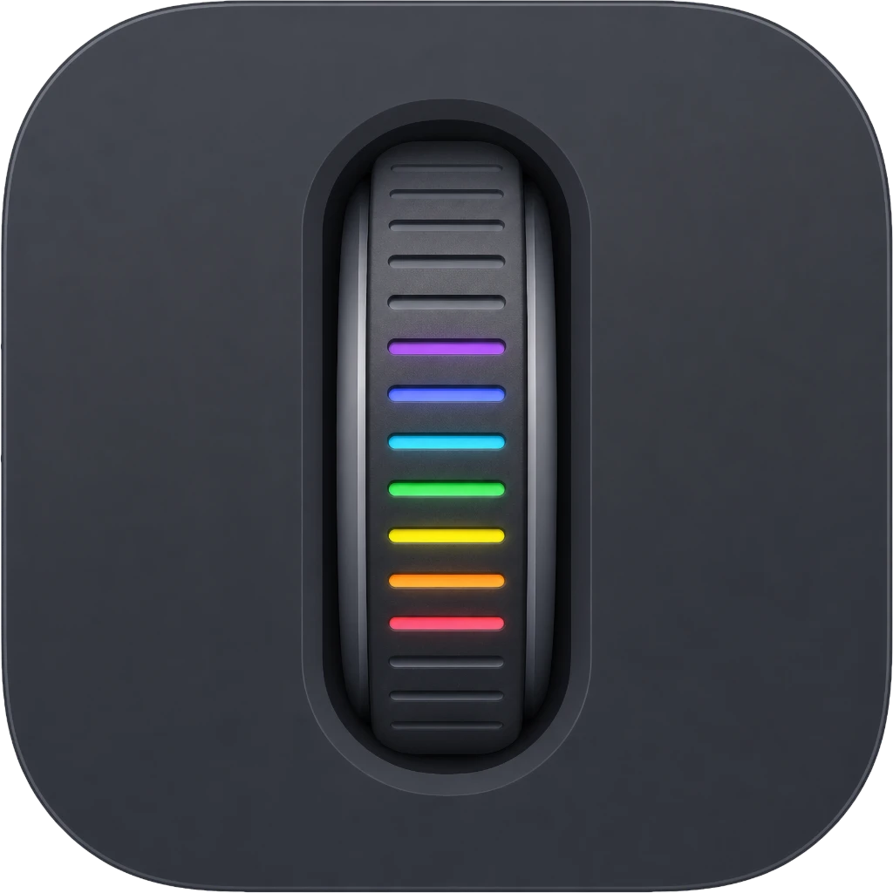

# MacVolumeControl

<p align="center">
  
</p>

<p align="center">
  <strong>优雅的 macOS 音量控制工具</strong>
</p>

<p align="center">
  专为外接显示器和系统音频设计的轻量级音量管理应用
</p>

---

## ✨ 特性

- 🖥️ **外接显示器音量控制** - 通过 DDC/CI 协议精准控制外接显示器音量
- 🖱️ **鼠标滚轮调节** - 在 Dock 区域、菜单栏区域或按住修饰键滚动调节音量
- 🎨 **触控板滑动支持** - 独立的触控板手势设置，更符合使用习惯
- 📊 **动态菜单栏图标** - 实时显示当前音量，滚轮图标随音量动态填充
- 🎯 **多种控制方式** - 灵活的音量调节选项，适应不同使用场景
- 🔇 **双击静音** - 快速静音/取消静音（可选）
- 🎛️ **自定义步进** - 支持 2%、5%、10% 三种音量调节幅度
- 💫 **OSD 显示** - 美观的音量调节界面提示
- 🚀 **开机自启** - 默认开机启动，无需手动运行
- 🌐 **完全中文** - 界面完全本地化

## 📦 安装

### 下载安装

1. 从 [Releases](../../releases) 页面下载最新的 `MacVolumeControl.dmg`
2. 打开 DMG 文件
3. 将 MacVolumeControl 拖到应用程序文件夹
4. 首次运行时授予必要的权限

### 从源码编译

```bash
git clone https://github.com/你的用户名/MacVolumeControl.git
cd MacVolumeControl
open MacVolumeControl.xcodeproj
```

在 Xcode 中按 `Cmd+R` 运行

## 🎮 使用方法

### 基本操作

- **鼠标滚轮**：在 Dock 区域或菜单栏区域滚动调节音量
- **触控板**：在 Dock 区域或菜单栏区域双指滑动调节音量
- **修饰键**：按住 Option（或其他修饰键）+ 滚动/滑动调节音量
- **双击图标**：快速静音/取消静音（可在设置中关闭）
- **单击图标**：打开偏好设置
- **右键图标**：显示快捷菜单

### 设置选项

应用提供四个设置标签页：

1. **通用** - 音量滑块、OSD 显示、双击静音、开机启动
2. **鼠标** - 鼠标滚轮的控制方式和步进设置
3. **触控板** - 触控板滑动的控制方式和步进设置
4. **关于** - 版本信息、反馈方式、恢复默认设置

## 🔧 系统要求

- macOS 13.0 或更高版本
- 支持 Apple Silicon (M1/M2/M3) 和 Intel 处理器

## ⚠️ 权限说明

应用需要以下权限：

- **辅助功能权限**（可选）：仅在启用"禁用系统原生滚动"功能时需要，用于拦截滚动事件

## 🛠️ 技术栈

- Swift + SwiftUI
- DDC/CI 协议（外接显示器控制）
- CoreAudio（系统音频控制）
- IOKit 私有 API（Apple Silicon DDC 支持）

## 📝 开发计划

- [ ] 键盘快捷键支持
- [ ] 音量预设功能
- [ ] 多显示器独立控制优化
- [ ] 自动更新功能

## 🤝 贡献

欢迎提交 Issue 和 Pull Request！

## 📧 反馈

如有问题或建议，请发送邮件至：Ericcil@163.com

## 📄 许可证

MIT License

---

<p align="center">
  Made with ❤️ for macOS
</p>
